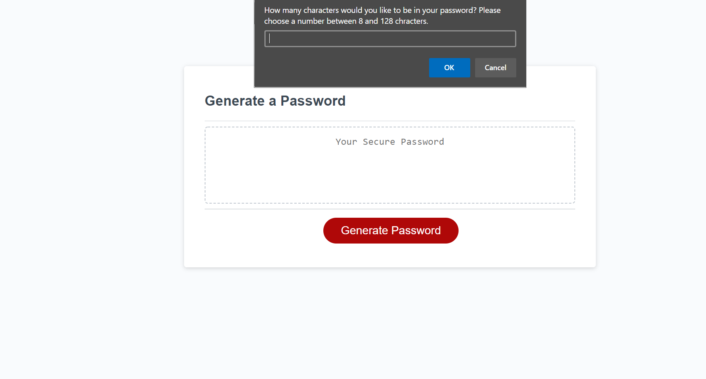
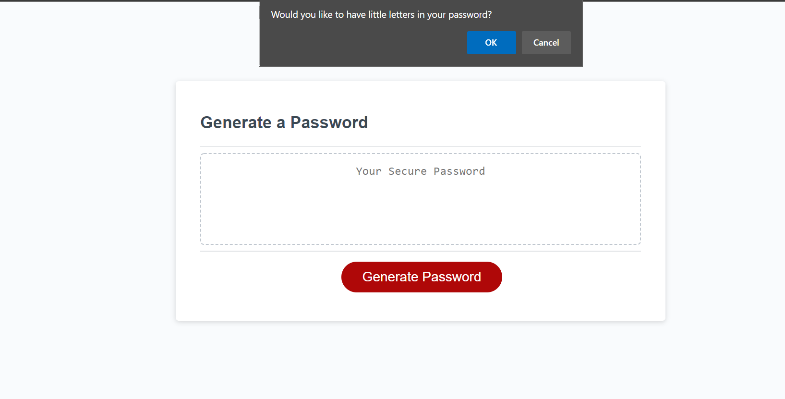
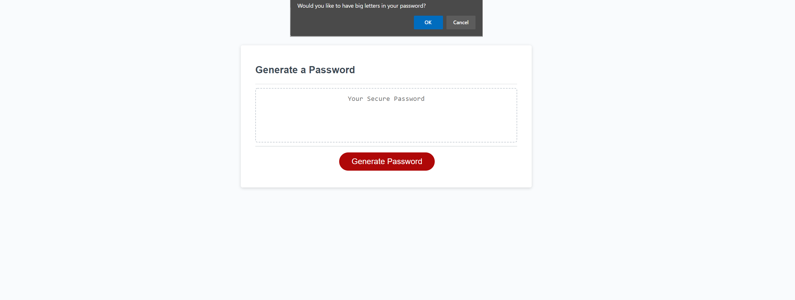
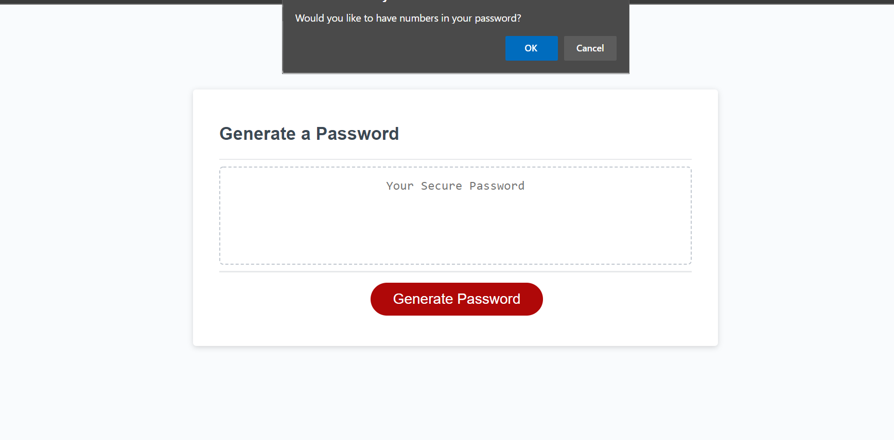
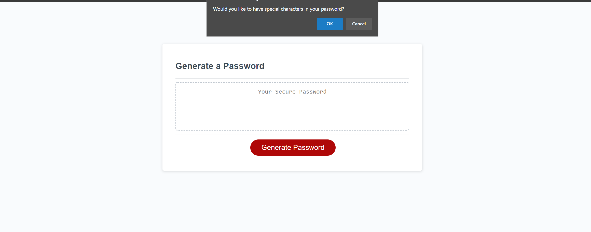
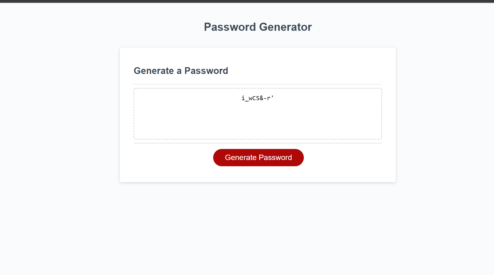

# Random Password Generator

# Deployed Application
[Password Generator](https://paullsshin.github.io/Gandalfs-Bridge/)
## Purpose:
Randomly generate a password that uses the inputs of the user. A prompt will appear and ask several questions of the user: how long the passowrd should be (between 8 and 128), if there should be lower case letters, if there should be upper case letters, if there should be numbers, and if there should be special characters.

### Action:
1.Start the page.
2.Press on the "Generate Password" button to begin.
3.Answer the prompt questions.
4.Password will generate after all questions have been answered.

### Usage
The prompts will ask a series of questions to determine what to generate for the suer's password. The prompts will ask how long the user would like their password to be, it will ask if they would like lower case letters, it will ask if the user would like upper case letters, it will also ask if the user would like numbers and special characters in their password as well. Once all the questions have been answered, then a password will be generated for the user so long as they stay within the given parameters.

### Screenshots

